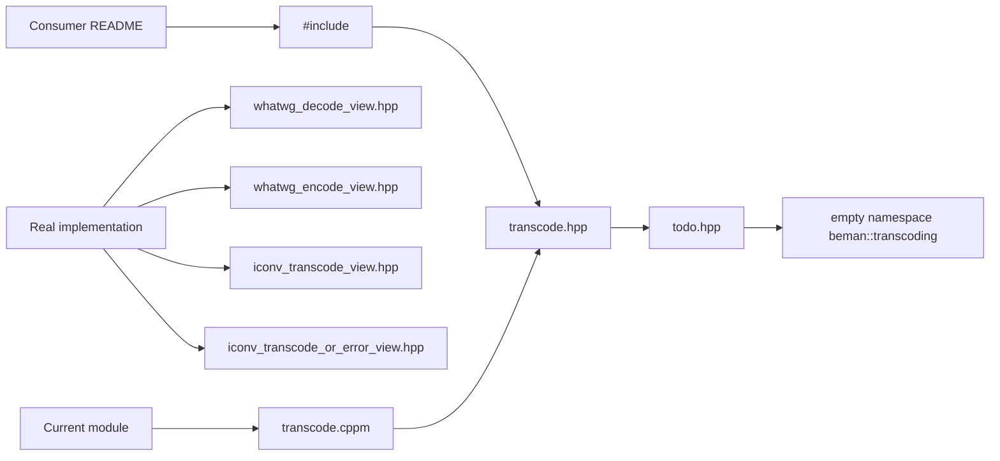
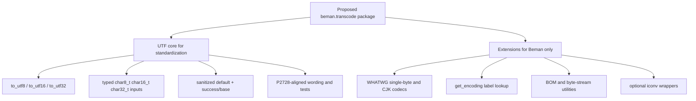

# Review of transcode as a C++29 Library Candidate and Beman Inclusion Candidate

## Executive summary

`steve-downey/transcode` already contains a substantial amount of serious engineering: a broad WHATWG-oriented transcoding implementation, dedicated single-byte lookup helpers, UTF-8 and UTF-16 decoders, iconv-based adapters, a large test tree, a multi-compiler CI matrix, vcpkg integration, CodeQL, dependency review, Scorecard, pre-commit checks, a Beman-style layout, and Apache-2.0 with LLVM exception licensing. On those foundations alone, it is clearly more than a sketch repo. citeturn4view0turn7view0turn8view0turn12view0turn39view0turn39view1turn42view0turn42view6turn42view7turn42view8

However, it is **not ready as a public Beman library** and **not ready to anchor a C++29 proposal** in its current form. The primary release blocker is that the public entrypoint documented in the README, `#include <beman/transcode/transcode.hpp>`, currently leads to `todo.hpp`, and `todo.hpp` exposes only an empty namespace. The module interface `transcode.cppm` exports that same empty umbrella. Examples are placeholders, and the install/export file set omits some headers that appear to be intended as public APIs. The repository therefore contains real implementation code, but the public package surface is still effectively unfinished. citeturn45view0turn27view0turn28view0turn25view0turn26view2turn30view0turn31view0

There are also **concrete correctness and safety issues** that must be fixed before inclusion. The iconv iterator keeps a fixed `char staging_[4]` buffer and repeatedly appends bytes without a visible bound check; for encodings or shift/state transitions that exceed four pending bytes, that is a real out-of-bounds write risk. The default iconv path also silently skips invalid or partial input in several branches, and the `_or_error` variant can still drop a byte on `E2BIG` when the output buffer is too small. Separately, the UTF-16 encoders accept any non-surrogate `char32_t` above `0xFFFF` and never reject values above `0x10FFFF`, which means out-of-range values can be encoded into bogus surrogate pairs. The UTF-16 decoders also explicitly document a simplification that consumes an invalid low-surrogate unit rather than replaying it, diverging from the more precise behavior described in the comments and from WHATWG-style maximal-subpart handling. citeturn13view1turn14view0turn19view8turn21view0turn21view1turn22view0turn22view1

The strongest strategic conclusion is that **transcode should be split conceptually into two layers**. A **P2728-aligned UTF-only core** should be the candidate for eventual standardization: typed UTF input, source-position/error reporting, and iterator categories that follow the careful SG16 design. A separate **Beman extension layer** should carry WHATWG label-driven decoders, legacy single-byte codecs, BOM/byte-stream handling, and optional iconv integration. The repository’s own architecture notes already move in that direction by saying the project should extend P2728 patterns for WHATWG and iconv, but the present code and docs still mix those concerns too tightly and compare against older P2728 revisions in the draft paper. citeturn46view0turn47view1turn44view0turn43search1

My recommendation is therefore: **do not accept it into Beman as a stable library yet; accept it only as an incubation effort after the P0 issues in the checklist are closed.** For C++29 proposal readiness, the answer is stronger: **not ready yet**, but definitely salvageable if the public API is completed, the correctness issues are fixed, and the proposal is reframed as a UTF core plus a non-standard extension layer. citeturn27view0turn28view0turn46view0turn44view0

### Audit summary

| Area | Assessment | Evidence |
|---|---|---|
| Code quality | Promising implementation depth, but with several release-blocking correctness and safety defects | citeturn16view0turn18view0turn13view1turn14view0turn22view0 |
| API design | Internals are interesting; public API is not shippable because the documented umbrella is empty | citeturn45view0turn27view0turn28view0 |
| Test coverage | Strong internal coverage, including representative unit tests, WPT-driven suites, roundtrips, iconv mocks, and compile-fail cases | citeturn34view0turn34view1turn33view2turn36view1turn36view2turn36view4turn36view5 |
| Build and CI | Strong for an incubation repo: GCC/Clang/AppleClang/MSVC, sanitizers, coverage, modules, vcpkg CI, CodeQL, Scorecard, dependency review | citeturn42view0turn42view1turn42view2turn42view3turn42view4turn42view6turn42view7turn42view8 |
| Documentation | Weak and internally inconsistent at the package/user level | citeturn45view0turn30view0turn46view0turn47view1 |
| Licensing | Strong and Beman-compatible | citeturn39view0turn39view1 |
| Portability | Mixed: strong CI breadth for the WHATWG layer, but iconv is a platform-specific extension with unclear Windows story | citeturn24view0turn42view1turn42view2 |
| C++29 compatibility | Conceptually adjacent to WG21 text work, but not API-compatible with P2728 and not yet proposal-polished | citeturn44view0turn44view1turn47view1turn46view0 |

## Repository status and engineering quality

At the repository-structure level, this already looks like a Beman-style project. The tree contains `include/`, `tests/`, `examples/`, `docs/`, `papers/`, `.github/workflows/`, a license, contribution guide, presets, and vcpkg configuration. The workflow directory includes CI, CodeQL, dependency review, pre-commit checks, Scorecard, doxygen deployment, and vcpkg release automation. That is a strong starting point for Beman inclusion. citeturn4view0turn7view0turn8view0turn9view0turn10view0turn11view0turn12view0

The CI story is especially good for an exploratory repo. The main workflow runs preset-based builds on Linux container images, macOS, and Windows; the build-and-test matrix covers GCC, Clang, AppleClang, and MSVC; and it includes sanitizer/werror/coverage/module variations. There is also a reusable vcpkg CI job, plus CodeQL, Scorecard, dependency review, and pre-commit automation. In other words, the project is already using the right operational scaffolding for a Beman candidate. citeturn42view0turn42view1turn42view2turn42view3turn42view4turn42view5turn42view6turn42view7turn42view8

Licensing is also in good shape. The repository license is Apache 2.0 with LLVM exceptions, and the source files shown in the review consistently carry SPDX headers matching that license. That is compatible with Beman norms and appropriate for a future reference implementation. citeturn39view0turn39view1turn23view0turn24view0turn27view0

The problem is that **package quality lags engineering quality**. The README tells users to include `beman/transcode/transcode.hpp`, but `transcode.hpp` currently includes only `todo.hpp`, and `todo.hpp` contains only an empty `beman::transcoding` namespace. The examples directory contains `todo.cpp`, which also does nothing. So the repo’s documented consumer entrypoint and examples are placeholders even though the internal component headers contain significant implementation. This is the single biggest reason I would not accept the library into Beman yet. citeturn45view0turn27view0turn28view0turn30view0turn31view0

There is a second packaging problem: the install/export header list appears incomplete. In the normal headers `FILE_SET`, `include/beman/transcode/CMakeLists.txt` lists `iconv_transcode_view.hpp`, `whatwg_decode_view.hpp`, and `whatwg_encode_view.hpp`, but does **not** list `iconv_transcode_or_error_view.hpp` or `iconv_real.hpp`, even though both exist in the source tree. In the module-enabled branch, the file set includes only `config.hpp`, `transcode.hpp`, `todo.hpp`, and the generated config header, which means the module/export branch is even more skeletal than the non-module branch. citeturn7view0turn24view0turn26view2turn26view3turn26view4

The documentation has similar inconsistencies. The README says tests require “GoogleTest”, but the test build actually uses Catch2 3. The README also advertises C++17 support, yet the implementation relies on concepts, ranges, and `std::expected`, and the CI matrix only exercises C++20/23/26 modes. Those discrepancies matter for Beman acceptance because they undermine trust in the project’s externally visible contract. citeturn45view0turn34view0turn34view2turn23view0turn14view0turn42view0



That gap between **real component code** and **empty public surface** is the core maturity mismatch in the repository. Everything else in this review sits downstream of that fact. citeturn25view0turn27view0turn28view0turn16view0turn18view0turn16view1turn16view2

## API design and code-level behavior

The internal API direction is clear. The repo defines a `legacy_byte_range` concept that accepts `char`, `signed char`, `unsigned char`, and `std::byte`, while rejecting raw arrays and typed UTF code-unit types. There is also a `unicode_scalar_range` concept for `char32_t`. That indicates a deliberate design choice: this library is built around **byte streams in external encodings** and **Unicode scalar values** as its internal semantic pivot. For WHATWG/web decoding and for raw file/network ingestion, that is a reasonable design. It is not, however, the same problem that P2728 is solving. citeturn23view0turn44view0turn47view1

The WHATWG decode layer is large and serious. The `codec` enum includes UTF-8, the WHATWG single-byte family, UTF-16BE/LE, and stateful multibyte codecs such as GBK, GB18030, Big5, Shift_JIS, EUC-JP, ISO-2022-JP, and EUC-KR. `whatwg_decode_view` and `whatwg_decode_or_error_view` are both input-range adaptors with `input_iterator_tag`, and they reject raw arrays with an explicit diagnostic that tells users to use a null-terminated-range adaptor instead. Those are thoughtful API choices. citeturn17view0turn14view1turn17view3turn17view4

The error API, though, is where the design starts diverging most sharply from standardization readiness. In the WHATWG layer, replacement-mode decoding sanitizes invalid sequences to `U+FFFD`, while the `_or_error` form changes the range’s `value_type` to `std::expected<char32_t, whatwg_error>`. That is workable, but it makes the *value channel* carry error policy. P2728 instead treats sanitized transcoding as the primary range behavior and gives the iterator a `success()` basis operation returning `expected<void, transcoding_error>`, so users can inspect errors without changing the element type of the range. P2728’s examples also use `base()` to relate a transcoded iterator back to the source position. transcode’s current iterators expose neither of those P2728-style facilities. citeturn19view8turn14view1turn44view1turn43search0

That difference is not merely aesthetic. A P2728-like `value_type == code_unit` model works smoothly with ordinary range pipelines and preserves the separation between “what is the transcoded element?” and “what happened while producing it?”. By contrast, an `expected<T,E>` element type is often excellent for explicit error-inspection pipelines, but awkward as the default basis operation for standard-library range adaptors. My recommendation is to keep the current `_or_error` form as a **Beman extension**, while adding a P2728-style status/position interface for the core UTF proposal path. citeturn14view1turn44view1

### Design issues and concrete defects

| Issue | Why it matters | Evidence | Recommendation |
|---|---|---|---|
| Public umbrella header is empty | The library is not actually consumable through its documented API | README tells users to include `transcode.hpp`; `transcode.hpp` includes `todo.hpp`; `todo.hpp` contains only an empty namespace. citeturn45view0turn27view0turn28view0 | Make `transcode.hpp` the real umbrella header immediately; do not ship until it exposes the supported API surface |
| Module export is empty | Module builds may succeed while exporting no usable public API | `transcode.cppm` exports `transcode.hpp`, which in turn lands in `todo.hpp` under the current layout. citeturn25view0turn27view0turn28view0 | Either complete the module or remove module claims until the public surface exists |
| Installed header set is incomplete | Consumers may not receive all intended public headers | `iconv_real.hpp` and `iconv_transcode_or_error_view.hpp` exist, but the non-module `FILE_SET HEADERS` shown here does not list them. citeturn24view0turn26view2turn26view3turn26view4 | Audit install/export completeness and add missing headers to the public file set |
| Fixed `staging_[4]` in iconv iterators | Unbounded appends to a 4-byte buffer are an out-of-bounds write risk for longer pending sequences/state transitions | Both iconv iterators use `char staging_[4];` and append with `staging_[staging_len_++] = ...` with no visible guard. citeturn13view1turn14view0 | Replace with bounded checked storage or resizable staging; at minimum hard-fail before overflow |
| iconv default view drops bytes on error | Silent data loss is a poor default for a library proposal | The default iconv view discards trailing incomplete input and skips bytes on `EILSEQ`/`E2BIG` branches. citeturn13view1 | Make dropping behavior opt-in; default should sanitize or surface status |
| `_or_error` iconv path can still drop bytes | Even “error-visible” mode loses data when output buffer is too small | On `E2BIG` with nothing written, it skips one staging byte and reports `output_full`. citeturn14view0 | Preserve the byte and report a resumable condition instead of discarding it |
| UTF-16 encoders do not reject `cp > 0x10FFFF` | Produces incorrect UTF-16 for out-of-range scalars | The encoders reject surrogates but then encode any larger value as a surrogate pair via `cp - 0x10000`. citeturn22view0turn22view1 | Add an explicit `cp > 0x10FFFF` check |
| UTF-16 decode knowingly consumes a bad low surrogate | Documented divergence from more precise replay behavior | Comments explain that on a bad low surrogate the implementation consumes all four bytes and emits one error because input iterators cannot back up. citeturn21view1turn22view0 | Either change the iterator/state model to replay correctly, or explicitly narrow semantics and document the divergence |
| C++ standard/version docs are inaccurate | Proposal/package consumers need trustworthy requirements | README claims C++17+ and GoogleTest, while code uses concepts/ranges/`std::expected` and tests use Catch2. citeturn45view0turn23view0turn14view0turn34view0 | Update README to the actually supported language/library matrix |
| Naming is inconsistent | Proposal polish and package discoverability suffer | Code uses `beman::transcoding`; README package target is `beman::transcode`; architecture notes talk about `beman::transcoding` target and a `transcoding` repo. citeturn23view0turn45view0turn46view0 | Settle on one library/package/namespace naming story before Beman acceptance |

### Targeted code suggestions

A small but high-value correctness fix is the UTF-16 encoder guard. The current implementation rejects surrogate code points, but it never rejects out-of-range values. The minimum safe change is:

```cpp
constexpr utf16_encode_result utf16be_encode_one(char32_t cp) {
    if (cp > 0x10FFFF || (0xD800 <= cp && cp <= 0xDFFF)) {
        return {{}, 0, true};
    }
    // existing logic...
}
```

The same guard belongs in `utf16le_encode_one()`. This is a low-effort, high-priority fix because it closes an unambiguous correctness bug. citeturn22view0turn22view1

The public umbrella should also stop being a placeholder and become a real library surface. At minimum, it should include the working public headers and expose one coherent namespace story:

```cpp
#ifndef INCLUDE_BEMAN_TRANSCODE_TRANSCODE_HPP
#define INCLUDE_BEMAN_TRANSCODE_TRANSCODE_HPP

#include <beman/transcode/whatwg_decode_view.hpp>
#include <beman/transcode/whatwg_encode_view.hpp>
#include <beman/transcode/iconv_transcode_view.hpp>
#include <beman/transcode/iconv_transcode_or_error_view.hpp>
#include <beman/transcode/iconv_real.hpp>

#endif
```

That is not yet the *ideal* long-term API, but it would at least make the documented header real and unblock package usability. citeturn45view0turn27view0turn28view0turn24view0

For P2728 alignment, I would further add status/position observability without forcing `expected<T,E>` as the only inspection path. Conceptually, the repository should grow something like:

```cpp
struct iterator_status {
    [[nodiscard]] std::expected<void, transcoding_error> success() const noexcept;
    [[nodiscard]] base_iterator base() const noexcept;
};
```

That lets the sanitized range remain a plain range of code units or code points while also supporting strict/error-reporting wrappers. It is the right compromise between the current design and the P2728 direction. citeturn44view1turn43search0

## Single-byte support and the feasibility of random-access iteration or indexing

The single-byte portion of the project is one of its strongest parts. The codec enum includes the WHATWG single-byte families such as IBM866, ISO-8859 variants, KOI8-R/U, Macintosh, Windows-874, Windows-125x, and x-mac-cyrillic, and the test suite contains both representative per-codec tests and a dedicated WPT-style single-byte executable. There is enough evidence here to say the single-byte scope is broad and intentionally conformance-oriented. citeturn17view0turn14view1turn33view4turn36view1turn36view2

At the implementation level, the single-byte decoder is a very simple and solid primitive: it consumes one byte, passes ASCII through directly, and otherwise does an O(1) table lookup into a 128-entry upper-half table; the single-byte encoder consumes one scalar and either passes ASCII through or scans the 128-entry table for the inverse mapping. That means the **decode side is inherently one input byte to one output code point**, and the **encode side is one input scalar to one output byte or one encode error**. citeturn19view0turn19view1turn19view2

That has an important consequence for iterator-category design: **random-access iteration and indexing is feasible and safe for single-byte codecs**, provided the underlying range itself is random-access and sized. Every byte boundary is a character boundary. There is no shift state. Difference in source bytes equals difference in decoded code points. Unlike UTF-8 or Shift_JIS, there is no “middle of character” ambiguity. So if this library keeps a unified input-only adaptor for all codecs, it should still consider **specializing single-byte decode/encode views** to provide `forward_range`, `bidirectional_range`, `random_access_range`, and `sized_range` when the underlying range qualifies. That would be a meaningful ergonomic and performance improvement. The current code leaves that performance on the table by giving the WHATWG iterators only `input_iterator_tag`. citeturn19view2turn14view1

By contrast, **generic random access is not safe for UTF-8, UTF-16 byte streams, or stateful legacy encodings**. The UTF-8 helper reads between one and four code units and has explicit invalid/truncated/overlong/surrogate/out-of-range cases. The UTF-16 helpers read two or four bytes depending on surrogate structure. And the project’s own draft paper explains why stateful multibyte encodings such as Shift_JIS force a forward-only model: from a pointer into the middle of the byte stream, you may not know whether you are at a character boundary at all. citeturn20view0turn21view0turn21view1turn47view4

P2728 reaches a similar conclusion in a more carefully structured way for UTF-only transcoding. Its iterator invariants distinguish input iterators from forward/bidirectional iterators; for input iterators, the current source iterator is at the end of the source subsequence for the current code point, while for forward/bidirectional iterators it is kept at the beginning of that subsequence. P2728 also explicitly discusses the complexities and inconsistencies that arise when iterators are formed in the middle of variable-length code points and when optimization loses intra-code-point position. So P2728 is **not** a generic O(1) random-access indexing proposal either; it is a careful ranges design for transcoding under well-understood iterator constraints. citeturn44view1turn43search0

### Feasibility matrix for random access

| Encoding family | Current iterator category | Is random-access decoding/indexing feasible? | Why | Recommendation |
|---|---|---|---|---|
| WHATWG single-byte decoders | Input only | **Yes**, if specialized on top of a random-access/sized source | One source byte always produces one decoded result; no state; all byte boundaries are valid boundaries. citeturn19view2turn14view1 | Add specialized single-byte views with stronger categories |
| WHATWG single-byte encoders | Input only | **Yes**, as a code-point-to-byte view over random-access `char32_t` input | One source scalar yields one byte or one encode error/replacement. citeturn19view1 | Add specialized single-byte encode views |
| UTF-8 byte streams | Input only | **No** for O(1) code-point indexing; **possibly** forward/bidirectional with careful iterator invariants | Variable length and malformed-sequence handling make arbitrary jumps unsafe. citeturn20view0turn44view1 | Do not promise random access; consider P2728-style forward/bidi semantics for typed UTF only |
| UTF-16BE/LE byte streams | Input only | **No** for O(1) code-point indexing | Code points are 2 or 4 bytes and malformed surrogates complicate replay. citeturn21view0turn21view1turn22view0 | Keep non-random-access semantics |
| Stateful multibyte legacy codecs | Input only | **No**, not generically safe | Prior bytes can determine meaning of current bytes; boundary recovery may require a scan from the start. citeturn47view4 | Keep input-only semantics |
| iconv generic byte-to-byte adapter | Input only | **No**, not generically safe | Generic iconv covers stateful encodings and currently uses mutable conversion state and an external output buffer. citeturn13view1turn24view0 | Treat as an extension, not a core random-access abstraction |

The key design implication is simple: **do not try to make the generic codec adaptor random-access**. Instead, add **specialized stronger-category adaptors only where the encoding family makes that mathematically valid**, starting with single-byte codecs. citeturn19view2turn47view4turn44view1

## Relationship to P2728

P2728 is about **UTF transcoding in the standard library**. Its basic motivation is to provide ranges-based UTF transcoding as a replacement path for the problematic `std::codecvt` facilities that are being removed, and its examples center on operations like `u8"..." | std::uc::to_utf32`. It also explicitly provides a basis operation for error inspection via iterator `success()`, while still allowing the ordinary range to sanitize invalid input to replacement characters. citeturn44view0turn44view1

The reviewed repository is solving a **different primary problem**. Its own draft paper says the proposal overlaps P2728 in the UTF portions but differs in scope and philosophy: P2728 uses typed UTF character ranges (`char8_t`, `char16_t`, `char32_t`), whereas this project uses raw byte ranges plus `char32_t`; P2728 is about UTF-8/16/32 interconversion, while this project is about external byte ingestion, explicit UTF-16 endianness, WHATWG legacy encodings, and web/interop scenarios. That is a valid design space, but it means transcode is **complementary to P2728**, not a drop-in replacement for it. citeturn47view1turn44view0

That divergence is visible in the code. The current `codec` enum includes `utf_8`, `utf_16be`, and `utf_16le`, but not UTF-32; the WHATWG views decode raw bytes to `char32_t` or encode `char32_t` to raw bytes. P2728, by contrast, is centered on typed UTF inputs and outputs across the UTF family. So as a C++29 library proposal, transcode currently does **not** cover the full UTF-8/16/32 triangle that P2728 targets. citeturn14view1turn17view0turn44view0

The error model also diverges. The current repo’s range-level `_or_error` APIs yield `expected<T, error>` elements, while P2728’s design direction is “sanitized value stream plus iterator `success()`” as the basis operation. For proposal readiness, I would strongly recommend following P2728 on this point for the UTF core. The present `expected<T,E>` element-type design can still be useful as a non-standard extension, but it should not be the only inspection mechanism if standardization is the goal. citeturn14view1turn44view1

The repository’s own documents also need rebasing. The architecture document says the project should extend **P2728R12** patterns for WHATWG and iconv and emphasizes Beman conformance and clean-room testing. But the current `papers/transcode-view.md` still compares itself against **P2728R6**. A serious C++29 effort should align its rationale, terminology, and compatibility story against the current paper revision, not an older one. citeturn46view0turn47view1turn43search1

### Current behavior versus P2728-like expectations

| Topic | transcode today | P2728 direction | Best path forward |
|---|---|---|---|
| Standardization target | Raw-byte ingestion, WHATWG legacy codecs, iconv extensions | UTF-only transcoding between typed UTF ranges | Split into a standardizable UTF core and a Beman extension layer citeturn47view1turn44view0 |
| Input model | `legacy_byte_range` and `char32_t` scalar ranges | `char8_t` / `char16_t` / `char32_t`-based UTF ranges | Add a typed UTF API rather than replacing the byte-oriented one citeturn23view0turn47view1turn44view0 |
| UTF coverage | UTF-8 and byte-stream UTF-16BE/LE; no UTF-32 codec in the current enum | UTF-8 / UTF-16 / UTF-32 transcoding | Add UTF-32 support for any proposal-core layer citeturn14view1turn44view0 |
| Error inspection | Element type becomes `expected<T,E>` in `_or_error` views | Sanitized value stream plus iterator `success()` | Keep `_or_error` as extension; add `success()` and source position for proposal path citeturn14view1turn44view1turn43search0 |
| Source position reporting | Not exposed in the reviewed iterator interfaces | Used in P2728 examples via `base()` | Add `base()` or equivalent source-offset accessors citeturn14view1turn13view1turn43search0 |
| Iterator strength | Input only across the board | Carefully richer semantics when the source allows it | Keep generic input-only, but specialize single-byte and typed UTF where safe citeturn14view1turn44view1turn19view2 |
| UTF-16 semantics | Explicit BE/LE byte streams | `char16_t` UTF-16 code units in native order | Keep byte-stream UTF-16 as extension; add typed UTF-16 in the core layer citeturn47view1turn44view0 |

### Suggested architectural split



That split would let the repository keep its most distinctive value while still becoming a credible WG21 reference implementation. citeturn46view0turn47view1turn44view0

## Concrete changes, tests to add, and documentation fixes

The most urgent code change is to make the project’s public surface real. `transcode.hpp`, `transcode.cppm`, the examples, and the install/export header file sets should all be fixed as one batch. Until that is done, the repository is effectively a collection of component headers and tests, not a library package. citeturn27view0turn28view0turn25view0turn26view2turn30view0

The next code batch should close the correctness defects. I would prioritize four edits: reject `char32_t` values above `0x10FFFF` in UTF-16 encoders; redesign the iconv staging buffer so it cannot overflow; remove or redesign silent byte-skipping paths in iconv views; and either make UTF-16 bad-low-surrogate replay precise or clearly narrow/document the semantics and corresponding expectations. Those are all code-level, objective, reviewable changes. citeturn13view1turn14view0turn21view1turn22view0turn22view1

The tests are already better than average, but they are not yet **proposal-grade**. There should be explicit regression tests for: out-of-range `char32_t` encoding to UTF-16; iconv pending sequences longer than four bytes; zero-length and one-byte output buffers in iconv paths; consumer builds that include only the documented public umbrella header; consumer module-import tests; and installation tests that verify every advertised public header is present after `cmake --install`. The existing suite already shows the project knows how to do this kind of disciplined testing. It just needs those missing cases added. citeturn33view0turn33view2turn34view1turn36view5

The documentation also needs a comprehensive cleanup. The README should stop claiming GoogleTest and C++17, and it should not point users at a public umbrella that currently exports nothing. The examples directory should contain at least one end-to-end byte decode example, one single-byte legacy example, one UTF-only example, and one optional iconv example with explicit platform notes. The draft paper should be rewritten against current P2728, should use canonical references, and should stop mixing the current repository with aspirational package names and namespaces. Notably, `papers/transcode-view.md` currently cites a noncanonical WPT mirror and frames the proposal around `std::views::transcode<codec>` while the repository code exposes separate WHATWG and iconv-specific adaptors. citeturn45view0turn30view0turn46view0turn47view1turn47view4

If the project wants to be especially strong as a Beman candidate, it should also expose a public null-terminated-range adaptor and a runtime label lookup facility. The papers already argue for both. The array-rejection diagnostics point users toward a null-terminated view model, and the draft proposal explicitly describes `get_encoding(std::string_view)` for WHATWG label handling. Those are high-value, user-visible additions for a byte-ingestion library. citeturn17view3turn17view4turn47view4

## Acceptance checklist for Beman inclusion and proposal readiness

The table below is the recommendation I would use for project triage.

| Priority | Item | Why it gates acceptance | Effort |
|---|---|---|---|
| P0 | Replace the TODO public surface with a real umbrella header, real examples, and a non-empty module export | The documented entrypoint currently exports no working library surface. citeturn45view0turn27view0turn28view0turn25view0turn30view0 | Medium |
| P0 | Fix the installed/exported file set so all intended public headers are actually shipped | Current `FILE_SET HEADERS` appears incomplete for the iconv public APIs. citeturn24view0turn26view2turn26view3turn26view4 | Low |
| P0 | Reject `char32_t > 0x10FFFF` in both UTF-16 encoders | This is an unambiguous correctness bug. citeturn22view0turn22view1 | Low |
| P0 | Redesign iconv staging so it cannot overflow and does not silently discard pending bytes | The current fixed 4-byte staging with unchecked append is a safety issue. citeturn13view1turn14view0 | High |
| P0 | Define a non-lossy default/error contract for iconv views | Current branches silently drop or skip bytes in several edge paths. citeturn13view1turn14view0 | High |
| P0 | Reconcile README claims with reality: Catch2, actual language standards, and actual public include path | Current consumer documentation is inaccurate. citeturn45view0turn34view0turn23view0turn14view0 | Low |
| P1 | Split the project into a P2728-aligned UTF core and a Beman-only WHATWG/iconv extension layer | That is the cleanest route to both Beman acceptance and WG21 relevance. citeturn44view0turn47view1turn46view0 | High |
| P1 | Add iterator-level error and source-position observability, P2728-style | Proposal readiness needs a basis operation more like `success()`/`base()`. citeturn44view1turn43search0 | Medium |
| P1 | Add explicit regression tests for UTF-16 out-of-range scalars, iconv long-incomplete sequences, zero-buffer cases, and installed-consumer builds | These are the highest-risk gaps relative to the current code. citeturn22view0turn13view1turn14view0turn36view5 | Medium |
| P1 | Specialize single-byte codecs to stronger iterator categories when the source allows it | Single-byte transcoding can safely offer more than `input_range`. citeturn19view2turn14view1 | Medium |
| P1 | Publish a coherent naming story for package, namespace, and proposal terminology | Current material mixes `transcode`, `transcoding`, `beman::transcode`, and `beman::transcoding`. citeturn23view0turn45view0turn46view0 | Low |
| P1 | Expose a public null-term adaptor and runtime encoding-label lookup if the byte-ingestion story remains in scope | The design and papers already point users toward those features. citeturn17view3turn17view4turn47view4 | Medium |
| P2 | Break up very large headers and reduce compile-time/code-size concentration | `whatwg_decode_view.hpp` is 1249 lines; `whatwg_encode_view.hpp` is 824 lines. That is maintainable today, but hard to scale. citeturn16view0turn18view0 | Medium |
| P2 | Add benchmark and fuzzing infrastructure beyond the current unit/WPT/roundtrip suite | Useful for hardening and proposal confidence, especially for parser/state-machine code | Medium |
| P2 | Rebase papers and docs onto current P2728 revision and canonical external references | The architecture notes cite P2728R12, while the draft paper still compares against R6 and uses noncanonical references. citeturn46view0turn47view1turn43search1 | Medium |

### Bottom-line recommendation

For **Beman inclusion**, I would classify the repository as **promising but not ready**. Its internal implementation, tests, CI, and licensing are already strong enough to justify continued investment, but the public API/package surface is still too incomplete and too inconsistent for stable inclusion. citeturn42view0turn39view0turn45view0turn27view0turn28view0

For **C++29 proposal readiness**, my answer is **not ready yet**. The project is adjacent to the standardization problem, but it presently diverges from P2728 in scope, input model, error-model shape, and UTF coverage. The right way forward is not to force the whole WHATWG/iconv design into the P2728 mold, but to standardize a narrower UTF core and keep the richer byte-ingestion/web-interop layer as a Beman extension. If that split is made, and the P0 issues above are resolved, the repository could become a strong reference implementation for a two-tier story: **WG21 UTF transcoding core, Beman web/legacy extension**. citeturn44view0turn44view1turn47view1turn46view0
